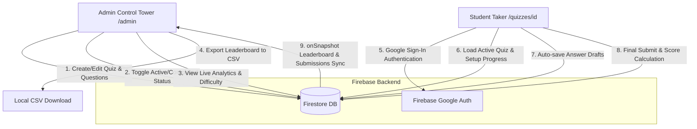

# 🧠 E-Cell Quizzes – Secure Quiz & Real-time Leaderboard System

[](https://nextjs.org/)
[](https://react.dev/)
[](https://firebase.google.com/)
[](https://tailwindcss.com/)
[](LICENSE)

A modern, fast, and interactive quiz platform built with **Next.js 16**, **React 19**, **Tailwind CSS v4**, and **Firebase (Firestore & Auth)**. It enables administrators to create, edit, and manage quizzes, track student submissions in real-time, view rich analytics and difficulty breakdowns, and automatically compile live leaderboards for E-Cell BVUDET Navi Mumbai events and competitions.

---

## 🚀 Key Features

* **🎨 Dynamic Quiz Builder & Manager**: Create, edit, and organize quizzes with custom descriptions, cover images, and structured multiple-choice questions (with optional image prompts). Set status directly to Draft, Active, or Completed.
* **⚡ Real-time Save & Auto-Resume**: Progress is continuously saved to Firebase Firestore as students take the quiz. If a session is interrupted, students can resume exactly where they left off without losing answers.
* **📊 Control Tower & Analytics**: Administrators have a detailed dashboard to monitor submissions, analyze individual question success rates via dynamic Recharts graphs, examine difficulty breakdowns, and toggle correct answer visibility for students.
* **🏆 Live Leaderboards & CSV Export**: Real-time leaderboards sorted by highest score and fastest completion time. Support for exporting full results directly to spreadsheet format (CSV).
* **🔒 Secure Google Authentication**: Protected admin routes and login enforcement to prevent unauthorized quiz taking, with roles mapped directly in Firestore.
* **💎 Neobrutalist UI/UX**: Designed with a high-contrast, premium, responsive layout featuring clean borders, bold colors, custom typography (Space Mono, EB Garamond, Inter), and micro-interactions.

---

## 🛠 Tech Stack

* **Framework**: [Next.js](https://nextjs.org/) (App Router, TypeScript)
* **Frontend library**: [React](https://react.dev/)
* **Styling**: [Tailwind CSS v4](https://tailwindcss.com/) (using `@tailwindcss/postcss`)
* **Backend / Database**: [Firebase Firestore & Auth](https://firebase.google.com/)
* **Analytics Charts**: [Recharts](https://recharts.org/)
* **Notifications**: [React Hot Toast](https://react-hot-toast.com/)

---

## 🏁 Getting Started

### 📋 Prerequisites

Ensure you have the following installed:
* [Node.js](https://nodejs.org/) (v18.x or later recommended)
* [npm](https://www.npmjs.com/) or yarn/pnpm

### ⚙️ Installation

1. **Clone the repository**:
   ```bash
   git clone https://github.com/anshvermadev/Quiz-system.git
   cd Quiz-system
   ```

2. **Install dependencies**:
   ```bash
   npm install
   ```

3. **Configure Environment Variables**:
   Create a `.env.local` file in the root directory and populate it with your Firebase API keys:
   ```env
   # Firebase Config
   NEXT_PUBLIC_FIREBASE_API_KEY=your_firebase_api_key
   NEXT_PUBLIC_FIREBASE_AUTH_DOMAIN=your_firebase_auth_domain
   NEXT_PUBLIC_FIREBASE_PROJECT_ID=your_firebase_project_id
   NEXT_PUBLIC_FIREBASE_STORAGE_BUCKET=your_firebase_storage_bucket
   NEXT_PUBLIC_FIREBASE_MESSAGING_SENDER_ID=your_firebase_messaging_sender_id
   NEXT_PUBLIC_FIREBASE_APP_ID=your_firebase_app_id
   ```

4. **Run the Development Server**:
   ```bash
   npm run dev
   ```
   Open [http://localhost:3000](http://localhost:3000) in your browser to view the application.

---

## 📖 Usage Guide

### 1. Setting up Firebase Firestore
This project requires Firestore to store data. Create the following two primary collections:
* `users`: Stores user credentials and privileges. To make a user an Admin:
  - Create a document with ID matching their Firebase Auth UID.
  - Set the field `isAdmin` to `true`.
* `quizzes`: Stores quiz configurations and questions, as well as a `submissions` subcollection under each quiz to track student attempts.

### 2. Seeding Initial Quizzes
To quickly populate your database with sample quizzes for testing:
* Sign in to the app, then navigate to `/seed` in your browser.
* Click **Seed Initial Quizzes** to populate sample American Sign Language (ASL) alphabets and daily phrases quizzes.

### 3. Administrator Workflow (Admin Control Tower at `/admin`)
* **Create/Edit Quizzes**: Go to the Control Tower dashboard and click **Create Quiz**. Enter quiz details and add questions. For each question, supply instructions, short titles, optional visual image prompt URLs, four multiple-choice options, and check the radio button for the correct answer.
* **Toggle Quiz Status**: Quizzes can be toggled between `Active` (accepting submissions), `Draft` (hidden), and `Completed` (locked/closed).
* **Toggle Results Visibility**: Use the **Show/Hide Details** button to dictate whether completed students can inspect the exact answer key details.
* **View Analytics & Leaderboard**: Inspect the live submission rate, average score, average time, difficulty charts, and student leaderboard. Click **Export CSV** to download a spreadsheet summary.

### 4. Student Workflow (Taking a Quiz at `/quizzes/[id]`)
* Students explore available quizzes on the home hub and log in securely via Google Authentication.
* As students answer questions, drafts are saved in real-time. If they close their browser, their progress is retrieved upon returning.
* Once the quiz is completed, the final score, submission time, and total time taken are calculated.

---

## 🔄 System Architecture & Data Flow

This application is built as a serverless quiz entry system connecting client-side quiz runners, interactive admins, and a real-time Firestore database.

### 📐 High-Level Architecture & Flow



### 🗄️ Database Schema & Relationships

1. **`users` (Collection)**: Stores registered profiles.
   - `uid`: Unique User ID (Firebase Auth UID)
   - `name`: Display name
   - `email`: Registered email address
   - `isAdmin`: Boolean flag granting access to the `/admin` dashboard

2. **`quizzes` (Collection)**: Stores quiz rules and questions.
   - `id`: Unique Quiz ID/Slug
   - `title`: Name of the quiz
   - `description`: Text details of the quiz
   - `coverImage`: URL of the cover image
   - `status`: `'active'` | `'completed'` | `'draft'`
   - `showAnswerDetails`: Boolean flag to show correct answer details to students
   - `createdBy`: UID of the creator admin
   - `createdAt`: ISO Timestamp string
   - `questions`: Array of `Question` objects:
     - `id`: Question ID
     - `title`: Question prompt
     - `image`: Optional image URL for visual prompts
     - `instruction`: Main directive (e.g. "Identify this sign")
     - `options`: Array of string choices
     - `correctOptionIndex`: Number indicating correct choice (0-indexed)

3. **`quizzes/{quizId}/submissions` (Subcollection)**: Stores student quiz progress and final score.
   - `userId`: Submitting student's UID
   - `userName`: Name of the student
   - `userEmail`: Email of the student
   - `quizId`: ID of the quiz
   - `answers`: Map of `questionId` to selected option index
   - `score`: Total correct answers scored
   - `totalQuestions`: Number of questions in the quiz
   - `startedAt`: ISO Timestamp of starting the quiz
   - `completedAt`: ISO Timestamp of submission (or null if in-progress)
   - `timeTaken`: Duration in seconds to finish the quiz
   - `status`: `'in-progress'` | `'completed'`
   - `lastQuestionIndex`: Index of the last attempted question for resume purposes

---

## 👥 UX Flow (User Journeys)

```
[ ADMIN JOURNEY ]
   Login as Admin -> Control Tower -> Create Quiz -> Add Questions & Images -> Activate Quiz -> Monitor Submissions in Real-time -> Export Leaderboard

[ STUDENT JOURNEY ]
   Explore Available Quizzes -> Google Login Challenge -> Start Active Quiz -> Real-time Autosave -> Submit Responses -> View Instant Score / Answer Key
```

### 1. The Admin Experience
* **Control Tower Dashboard**: Provides instant visibility into quiz states (Active, Completed, Draft).
* **Visual Quiz Builder**: Allows admins to add, rearrange, and remove questions on the fly, with auto-slug generation based on the title.
* **Interactive Analytics**: Displays submissions count, average score, average time, and a dynamic Recharts difficulty bar chart.

### 2. The Student Experience
* **Zero-Friction Authentication**: Simple login with Google and auto-profile registration.
* **Auto-Save & Resume**: Seamless protection against connectivity issues. Answers are pushed to Firestore as students click through.
* **Protected Answer Keys**: Shows incorrect vs correct answers only if the admin toggles it or if the quiz is marked Completed.

---

## 🤝 Contribution Guidelines

Contributions are welcome! Please read our [CONTRIBUTING.md](CONTRIBUTING.md) to learn how to propose changes, report bugs, or submit pull requests.

To get started with contributions:
1. Fork the Project
2. Create your Feature Branch (`git checkout -b feature/AmazingFeature`)
3. Commit your Changes (`git commit -m 'Add some AmazingFeature'`)
4. Push to the Branch (`git push origin feature/AmazingFeature`)
5. Open a Pull Request

---

## 🛠 Support & Help

If you run into issues or have questions:
* Refer to the Next.js [official documentation](https://nextjs.org/docs) for framework queries.
* Refer to the Firebase [official documentation](https://firebase.google.com/docs) for database/authentication queries.

---

This project is licensed under the terms of the MIT License. See [LICENSE](LICENSE) for details.
